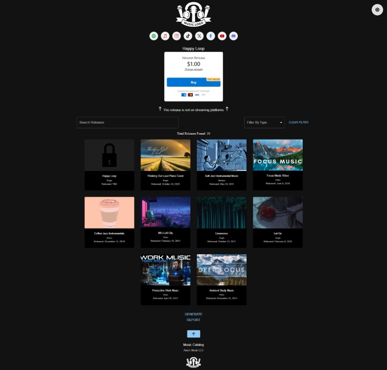

# Music Catalog Web Application

## Concept
A dynamic, full-stack web application to showcase and distribute music releases for an independent artist. The app allows fans to access music in one place even when releases might be located on many different platforms. Users are also able to support the artist directly by purchasing access to exclusive content and using direct links to streaming platforms, music stores, ect.

## Tech Stack
*React, Node.js, Vercel, Stripe API, AWS S3, Material UI, JSON, GitHub, CSS, HTML*

- Implemented React.js for the front-end, creating responsive and interactive UI elements such as embedded music players, filters, and search components using Material UI.
- Designed for mobile-first responsiveness, ensuring a seamless user experience across different devices and screen sizes.
- Implemented advanced filtering and search functionalities, handling a large catalog of music releases efficiently.
- Utilized Node.js and serverless functions hosted on Vercel to handle payment verification, audio link generation, and secure API requests.
- Integrated Stripe API for secure payment processing, enabling users to purchase and download exclusive music content.
- Leveraged AWS S3 for hosting audio files, providing exclusive temporary access to the files for users post-purchase.
- Integrated localStorage for storing user-specific data, enhancing the personalized user experience across sessions.
- Deployed the app on Vercel, with GitHub version control for continuous deployment and collaboration.

## Backstory
I originally created the app as a personal project for a musician that I know, and I later used it as my project for my D424 Software Engineering Capstone course at WGU. The capstone project required much more formal documentation for the app so I have included those documents that I was required to complete for the course. I believe the documents offer a comprehensive breakdown for everything to do with the application.

## Demo Link
URL: [https://music-catalog-web-app.vercel.app/](https://music-catalog-web-app.vercel.app/)

